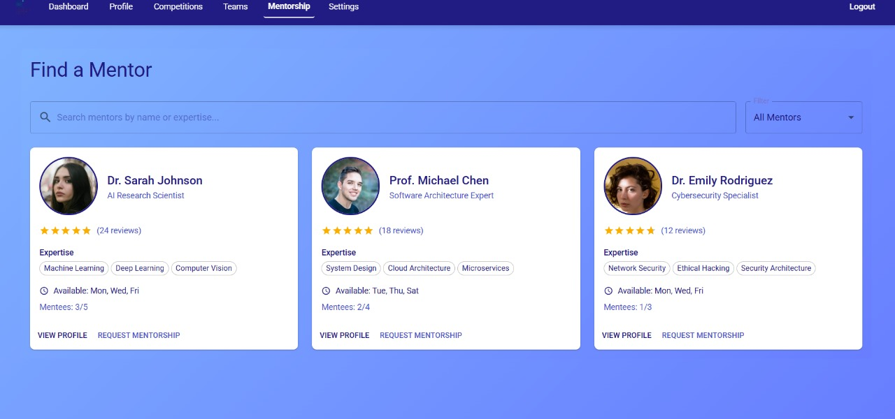
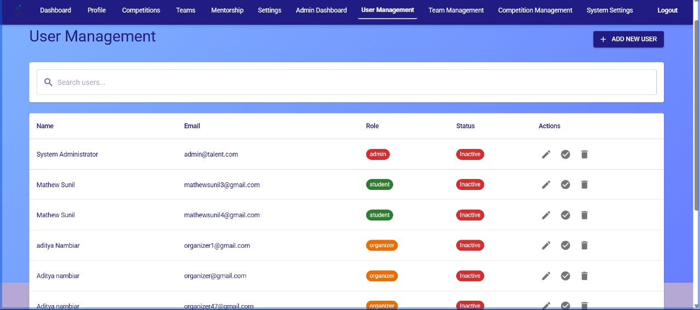
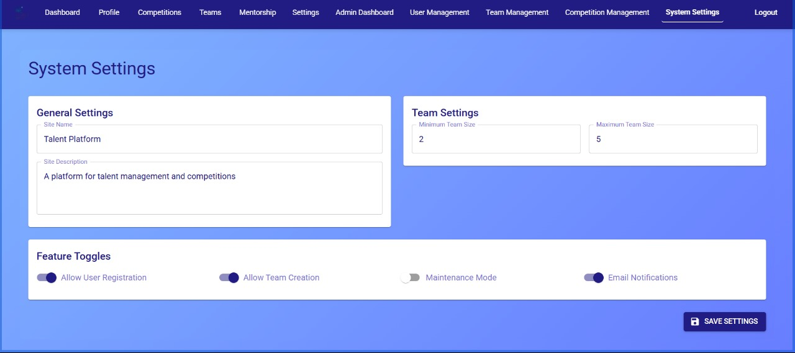
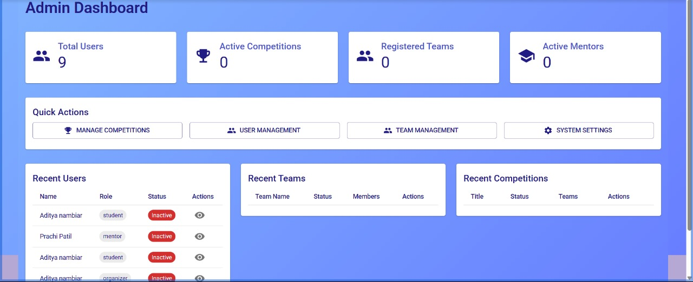
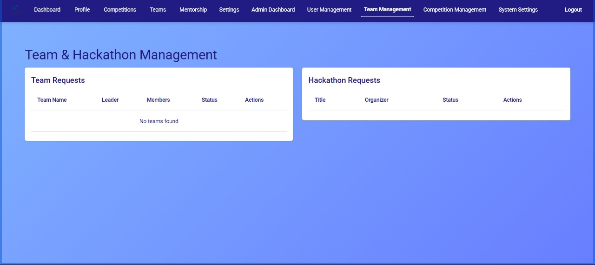
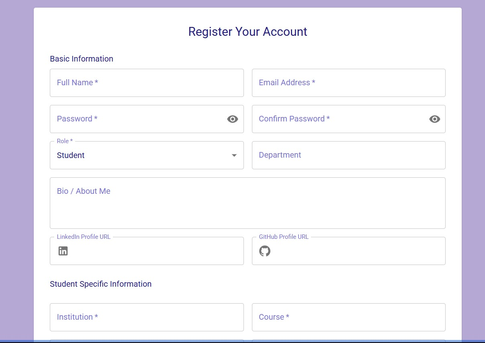
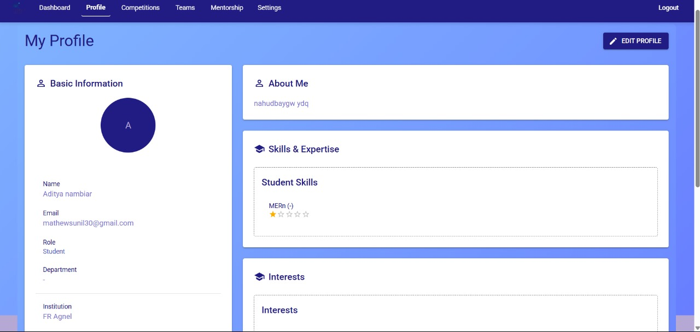
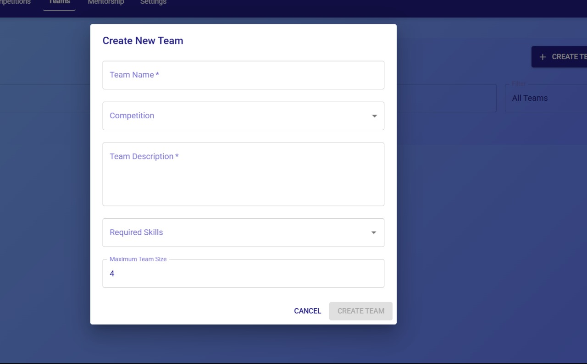
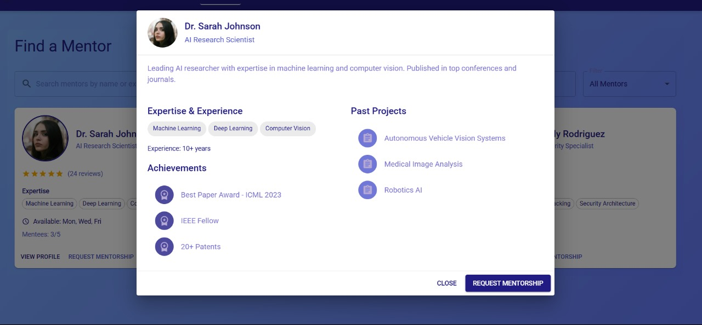
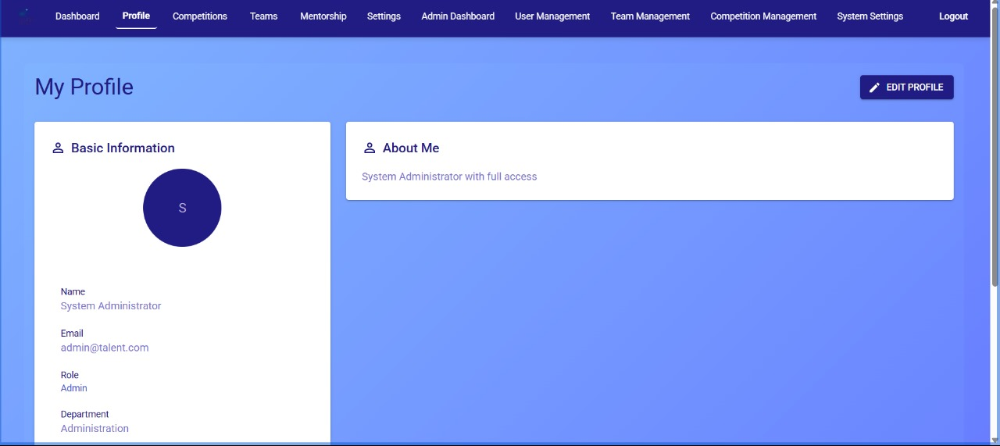

# 💡 Talent | Full Stack Web Application

A 4th Semester Full-Stack Development Project that empowers students to connect, collaborate, and compete — with built-in mentorship and intelligent team formation.

---

## 🔍 Overview

This platform bridges the gap between students, mentors, and event organizers by offering a unified solution to:

- Discover like-minded peers
- Form or join competition teams
- Get assigned relevant mentors
- Engage in events and hackathons

---

## 🎯 Goal

To create a full-fledged, scalable application that streamlines the process of **student networking, mentorship management, and event participation**, all through a modern and responsive UI backed by a powerful backend.

---

## ⚙️ Technology Stack

**Frontend**  
- React.js  
- Tailwind CSS  
- Framer Motion  

**Backend**  
- Node.js with Express  

**Database**  
- MongoDB  

**Real-time Communication**  
- WebSockets  

---

## 🌟 Core Functionalities

- 🔑 Secure User Auth (Signup, Login, Reset)
- 🛠️ Dynamic CRUD for key entities
- 🧑‍🏫 Role Management (Student / Mentor / Admin)
- 📱 Fully responsive across devices
- 🔁 Real-time data sync using sockets
- 🔍 Search, filters, and voice accessibility features
- 🎤 **UX Enhancements**: Voice control access & adjustable font size

---

## 📽 Demo Video

https://drive.google.com/drive/folders/1CAxF6ZvPTNfuecm2lDpsdUdMHDxAUQdl

## 📸 Screenshots

<!-- Add your actual image paths/screenshots here -->












1. Clone the repo:  
   ```bash
   git clone https://github.com/piyushx-git/Talent.git
   cd Talent

---

## 🧪 How to Run the Project

### Prerequisites
- Node.js v18+ (for React)
- Python 3.9+ & pip (for Django)
- Sqlite
- `.env` files for secrets (see `.env.example`)

## 🛠️ Local Setup

Follow these steps to run the project locally on your machine:

---

### 1️⃣ Clone the Repository

```bash
git clone https://github.com/piyushx-git/Talent.git
cd Talent
```

---

### 2️⃣ Set Up the Backend (Node.js + Express)

```bash
cd backend
npm install
```

---

Start the backend server:

```bash
npm start
```

> The backend will run on: `http://localhost:5000`

---

### 3️⃣ Set Up the Frontend (React)

Open a new terminal:

```bash
cd frontend
npm install
npm start
```

> The React app will open at: `http://localhost:3000`

---


